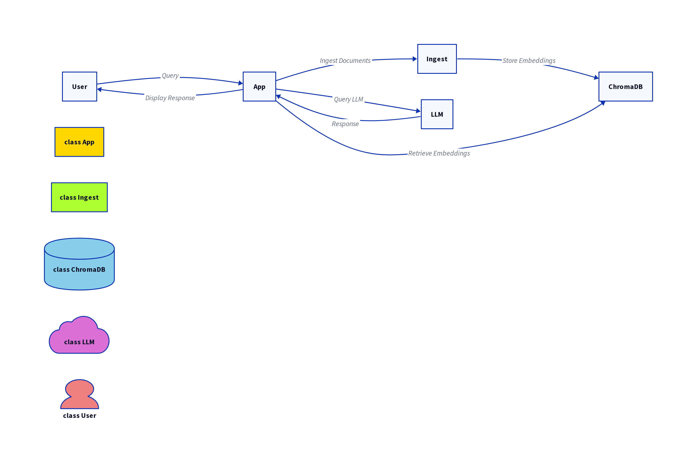

# 🧠 Risk Whisperer: AI-Powered Risk & Issue Intelligence for Program Managers

Risk Whisperer is a GenAI-driven application designed to analyze project risk registers, issues logs, and lessons learned documents using advanced NLP and retrieval-augmented generation (RAG). Built by and for senior Program Managers, it leverages LangChain, ChromaDB, and OpenAI GPT to surface insights, flag blind spots, and suggest mitigations — all in natural language.



---

## 🚀 Features

✅ **Risk & Issue Intelligence** – Ingest PDFs and TXT docs containing risks, issues, and lessons learned  
✅ **Semantic Search + Retrieval** – Find similar historical risks via vector embeddings (HuggingFace)  
✅ **OpenAI-Powered Q&A** – Ask contextual questions about risks, strategies, trends, and more  
✅ **Gradio Web Interface** – Or use the command line like a pro  
✅ **Fully Local Vector Store** – Uses ChromaDB (no cloud vendor lock-in)  
✅ **Extendable for Governance/Compliance** – Can integrate with ISO 31000, PRINCE2, MSP, etc.

---

## 🧱 Architecture

1. **Document Loader**: Parses PDFs and plain text documents into semantic chunks  
2. **Text Splitter**: Breaks long docs into retrievable blocks  
3. **Embedding Model**: Converts each block into numerical vectors using `sentence-transformers`  
4. **Vector Store (ChromaDB)**: Persists all embedded chunks for fast, similarity-based querying  
5. **Retrieval Chain (LangChain)**: Retrieves context + passes to OpenAI LLM for synthesis  
6. **Interface**: CLI or Gradio Web UI for interaction

---

## 🛠️ Tech Stack

- [Python 3.8+](https://www.python.org/)
- [LangChain](https://www.langchain.com/)
- [ChromaDB](https://www.trychroma.com/)
- [HuggingFace Sentence Transformers](https://huggingface.co/sentence-transformers)
- [OpenAI GPT-4](https://openai.com/)
- [Gradio](https://gradio.app/)
- Optional: Integration with `Watsonx.ai`, `Azure OpenAI`, `Claude`, `LLM Orchestration`

---

## ⚙️ Getting Started

### 1. Clone the Repo

```bash
git clone https://github.com/YOUR_USERNAME/risk-whisperer.git
cd risk-whisperer
2. Install Dependencies
bash
Copy
Edit
pip install -r requirements.txt
3. Add Your OpenAI API Key
Create a .env file:

bash
Copy
Edit
OPENAI_API_KEY="your-api-key-here"
🔐 .env is already listed in .gitignore – your keys stay secure.

📥 Ingest Your Risk Documents
Drop your .pdf or .txt files into the data/ directory, then run:

bash
Copy
Edit
python ingest_docs.py
This will:

Load and split your docs

Embed them

Persist vectors into chroma_store/

🧪 Run the App
🖥️ CLI Mode
bash
Copy
Edit
python app.py
🌐 Web Interface
bash
Copy
Edit
python app_gradio.py
🔍 Example Queries
Risk Whisperer supports natural prompts like:

“What are common risks in large ERP deployments?”

“Summarize lessons learned from multi-vendor projects.”

“Suggest mitigation strategies for scope creep in Agile delivery.”

“Find similar issues to vendor non-performance from the uploaded logs.”

🧩 Roadmap
 Add ISO 31000 / PRINCE2 / SAFe tag classification

 Add metadata-based filtering (e.g., by date, impact, priority)

 Export risk logs with AI-generated summaries

 Deploy as Dockerized microservice

 Connect to Microsoft 365 / Google Workspace docs

🧑‍💼 Built For
Enterprise PMOs, Digital Transformation Leaders, Government of Canada Program Managers, and any delivery pro buried under RAID logs and lessons learned decks.

🧠 Author
Ryan W. Dear, MSP®, PRINCE2®, CRMP®, SAFe®, MIT AI Specialist

25+ years in digital transformation, program delivery, and enterprise PMO leadership
Now building agentic AI to empower the next generation of risk-aware, insight-driven program leaders.
